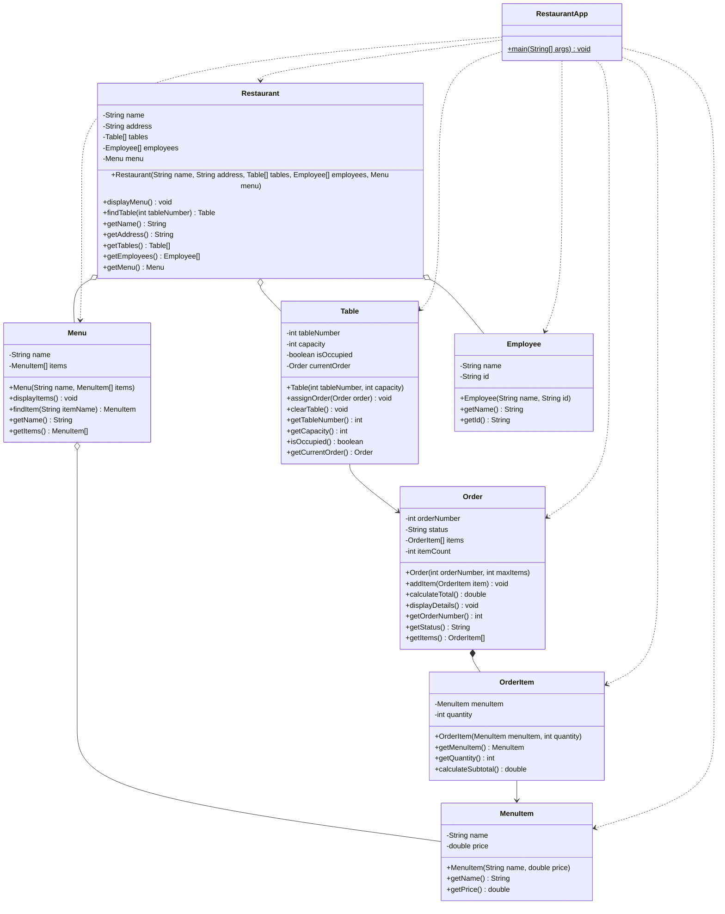

# Sistema de Gestión de Restaurante - Narrativa del Proyecto

## ¿Qué es este proyecto?

Este es un sistema digital que simula cómo funciona un restaurante en la vida real. Imagina que estás visitando un restaurante llamado "La Buena Mesa". Este programa recrea toda esa experiencia, desde que ves el menú hasta que pagas tu cuenta.

---

## La Historia: Un día en "La Buena Mesa"

### 1. **El Restaurante abre sus puertas**

Cuando el restaurante abre, ya tiene todo preparado:

- **El edificio**: Un local llamado "La Buena Mesa" ubicado en la Calle Principal 123
- **Las mesas**: Tiene varias mesas numeradas, cada una con capacidad para diferentes números de personas
  - Mesa 1: para 4 personas
  - Mesa 2: para 2 personas
- **El personal**: Empleados como Carlos y María, cada uno con su identificación única
- **El menú**: Una carta con todos los platillos y bebidas disponibles con sus precios

### 2. **Llegan los clientes**

Cuando tú llegas al restaurante, lo primero que ves es el menú. El sistema te muestra:

```
=== MENÚ PRINCIPAL ===
1. Hamburguesa Clásica - $15.00
2. Pizza Margherita - $18.00
3. Refresco - $3.00
4. Ensalada César - $12.00
```

### 3. **Te sientan en una mesa**

El anfitrión te asigna la Mesa 1, que tiene capacidad para 4 personas. En este momento:
- La mesa estaba libre (desocupada)
- Ahora está ocupada porque tú estás sentado ahí

### 4. **Haces tu pedido**

Decides ordenar:
- 2 Hamburguesas Clásicas
- 2 Refrescos

El mesero toma nota de tu pedido. Cada pedido tiene:
- Un número único (por ejemplo, Pedido #101)
- Una lista de lo que ordenaste
- Un estado que dice si está "Pendiente", "En Preparación" o "Completado"

### 5. **El sistema calcula tu cuenta**

Cuando el mesero ingresa tu pedido, el sistema automáticamente calcula:

```
--- DETALLES DEL PEDIDO #101 ---
Estado: Pendiente
Items:
  - Hamburguesa Clásica x2 - $30.00
  - Refresco x2 - $6.00

TOTAL A PAGAR: $36.00
```

### 6. **Terminas de comer y te vas**

Cuando pagas y te levantas de la mesa:
- La mesa queda nuevamente libre (desocupada)
- Está lista para recibir a otros clientes
- Tu pedido ya fue completado

---

## Diagrama de Clases del Sistema

A continuación se presenta el diagrama de clases que muestra la estructura completa del sistema y las relaciones entre sus componentes:



### Interpretación del Diagrama

**Clases principales:**
- **RestaurantApp**: Clase principal que ejecuta la aplicación
- **Restaurant**: Representa el restaurante completo
- **Menu**: Contiene todos los items disponibles
- **MenuItem**: Cada platillo o bebida del menú
- **Table**: Las mesas del restaurante
- **Employee**: El personal que trabaja en el restaurante
- **Order**: Los pedidos realizados por los clientes
- **OrderItem**: Cada item individual dentro de un pedido

**Relaciones:**
- `*--` (Composición): El Order contiene OrderItems que no pueden existir sin el pedido
- `o--` (Agregación): El Restaurant, Menu y Table contienen otros objetos pero estos pueden existir independientemente
- `-->` (Asociación): OrderItem conoce a MenuItem, Table conoce a Order
- `..>` (Dependencia): RestaurantApp usa las demás clases

---

## ¿Cómo funciona todo esto por dentro?

### Los elementos principales del restaurante:

#### 🏢 **El Restaurante**
Es como el edificio completo. Contiene todo lo necesario para funcionar:
- Nombre y dirección
- Todas las mesas
- Todo el personal
- El menú completo

#### 📋 **El Menú**
Es la carta del restaurante. Contiene todos los platillos y bebidas que puedes ordenar, cada uno con:
- Nombre del platillo
- Precio

#### 🍔 **Los Items del Menú (MenuItem)**
Cada platillo o bebida individual que aparece en el menú. Por ejemplo:
- "Hamburguesa Clásica" que cuesta $15.00
- "Refresco" que cuesta $3.00

#### 🪑 **Las Mesas**
Cada mesa tiene:
- Un número que la identifica
- Capacidad (cuántas personas pueden sentarse)
- Estado (si está ocupada o libre)
- El pedido actual (si hay clientes comiendo)

#### 👨‍🍳 **Los Empleados**
El personal del restaurante. Cada empleado tiene:
- Un nombre
- Un código de identificación único

#### 📝 **Los Pedidos (Order)**
Cuando haces un pedido, se crea una "orden" que contiene:
- Un número de pedido único
- El estado (pendiente, en progreso, completado)
- Todos los items que ordenaste
- El total a pagar

#### 🍽️ **Items del Pedido (OrderItem)**
Cada cosa que ordenaste con su cantidad. Por ejemplo:
- 2 Hamburguesas (no solo "hamburguesa", sino específicamente "2")
- 2 Refrescos

---

## ¿Por qué está organizado así?

### Relaciones en el mundo real:

**1. El Restaurante CONTIENE (pero no crea):**
- Las mesas fueron compradas y traídas al restaurante
- Los empleados fueron contratados
- El menú fue diseñado

Si el restaurante cierra, las mesas se pueden vender, los empleados pueden buscar otro trabajo, y el menú se puede usar en otro lugar. **Nada se pierde**.

**2. El Menú AGRUPA (pero no crea):**
- Los platillos existían antes (las recetas)
- El menú solo los reúne y los presenta

Si cambias de menú, los platillos siguen existiendo.

**3. El Pedido CREA sus propios items:**
- Cuando haces un pedido de "2 hamburguesas", eso solo existe DENTRO de tu pedido
- Si cancelas tu pedido, esos "2 hamburguesas del pedido #101" desaparecen
- (Pero la hamburguesa del menú sigue existiendo para otros clientes)

**4. La Mesa TIENE ASIGNADO un pedido:**
- Cuando te sientas y ordenas, tu pedido se asocia con tu mesa
- Cuando te vas, la mesa se limpia pero tu pedido ya fue procesado
- La mesa no "posee" el pedido, solo lo tiene temporalmente

---

## El flujo completo en palabras simples:

1. **El restaurante abre** → Todo está listo (mesas, empleados, menú)
2. **Llegas tú (el cliente)** → Te muestran el menú
3. **Eliges una mesa** → Te asignan la Mesa 1
4. **Haces tu pedido** → El sistema crea un nuevo pedido con lo que quieres
5. **El sistema calcula** → Te dice cuánto vas a pagar
6. **Comes y pagas** → El pedido se completa
7. **Te vas** → La mesa queda libre para el siguiente cliente

---

## ¿Para qué sirve este sistema?

Este programa es útil para:

✅ **Restaurantes pequeños** que quieren digitalizar su proceso de pedidos
✅ **Aprender** cómo se organizan sistemas en la vida real
✅ **Simular** operaciones de un restaurante sin gastar dinero real
✅ **Entrenar personal** nuevo en cómo funciona el flujo de trabajo

---

## Ejemplo de uso real:

Imagina que eres el gerente del restaurante. Con este sistema puedes:

- Ver qué mesas están ocupadas o libres
- Saber qué pidió cada mesa
- Calcular automáticamente las cuentas
- Llevar un registro de todos los pedidos
- Gestionar tu menú y precios
- Organizar a tu personal

Todo esto, sin papel, sin errores de cálculo, y de forma organizada.

---

## Conclusión

Este sistema digital replica la experiencia completa de un restaurante, desde que el cliente llega hasta que se va. Cada parte del sistema representa algo real y tangible que encontrarías en cualquier restaurante del mundo.

Es como construir un restaurante virtual donde todo funciona automáticamente: las mesas se asignan, los pedidos se toman, las cuentas se calculan, y todo queda registrado de forma ordenada.

**En resumen:** Es un restaurante completo... ¡pero en código! 🍽️✨
